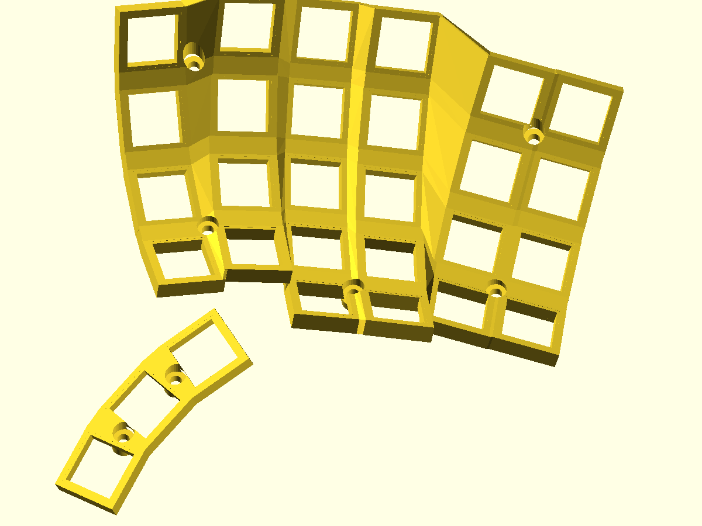

# Cosmotyl

A Python + OpenSCAD generator for a split ergonomic keyboard with curved,
floating key plates, a three-key thumb pod, and a flat base with screw columns.
The default layout has **29 keys per half**: 26 finger keys and 3 thumb keys.



The current v4 design prints as three parts per half: a finger sheet, a thumb
pod, and a base. Each screw recess has a continuous 3.4 mm thick bearing pad;
matching columns end 0.15 mm below the pad. The generated and exported meshes
pass closed-surface, bearing-seat, switch-envelope, screw-head, and assembly
interference checks. See [validation notes](docs/validation.md).

This remains a prototype: electronics mounting, wrist-rest integration, and
physical print/assembly trials are unfinished. The overhang heuristic still
flags one patch on the finger sheet. Earlier v1 and v3 source generators are
kept for reference; their obsolete STL exports have been removed.

## Explore the design

Download or clone the repository and open
[`output/keywell_viewer.html`](output/keywell_viewer.html) in a WebGL-capable
browser. It embeds the meshes and three.js and works offline. Drag to orbit,
scroll to zoom, and use the controls to inspect the parts, mirrored left half,
switch envelopes, and thumb placement geometry. Top and base have separate
toggles. GitHub's HTML file view shows source; download the file to run it.

## Generate

Python 3.10+ is required. The v4 mesh pipeline uses Manifold and NumPy to
preserve solid topology through Boolean operations and binary STL export.
The build evaluates the same literal geometry it writes to SCAD. OpenSCAD is
optional for inspecting that SCAD and required for the historical v1/v3 builds.

From the repository root:

```bash
python3 -m venv .venv
source .venv/bin/activate
python3 -m pip install -r requirements.txt
python3 src/verify.py          # keycap collision and bay headroom checks
python3 src/main4.py --fast    # check layout and write SCAD, no renderer needed
python3 src/main4.py           # mesh v4, verify seats/clearances, split print parts
python3 src/gen_viewer.py      # rebuild the offline viewer
python3 src/gen_viewer.py --prebuilt # use only the published example meshes
python3 -m unittest discover -s tests -v
```

Generators write working SCAD/STL files beside the sources in `src/`; these
are ignored by Git. The viewer prefers these fresh meshes and falls back to
prebuilt files in `output/`. After changing the layout, regenerate v4 before
rebuilding the viewer.
`--prebuilt` uses the checked-in example meshes exclusively.

Historical builds require OpenSCAD on `PATH`, in the standard macOS app
location, or configured through the `OPENSCAD` executable path:

```bash
python3 src/main3.py --fast    # omit --fast to render the v3 body
python3 src/main.py --fast     # omit --fast to render v1 case/base/wrist
python3 src/main.py --preview # also render preview PNGs (display required)
```

## Customize

Edit [`src/config.py`](src/config.py). All dimensions use millimeters and
angles use degrees. The canonical right half has +X toward the pinky, −Y
toward the user, and +Z upward.

- `COLUMNS`: column position, splay, travel, and row count.
- `THUMB`: anchor offset, orientation, fan radius, and angular spacing.
- `CASE`: tent, slope, lift, socket dimensions, and base thickness.
- `BATTERY` and `WRIST`: legacy bay probes and wrist-rest dimensions.

The preset derives from hand measurements adjusted for geometric clearance.
Raw traces and personal comfort analysis are excluded; the design dimensions
remain to reproduce the supplied model. See the
[measurement method](docs/hand_geometry_report.md).
The v4 screw sites in `main4.py` assume the included column layout and must be
reviewed when changing the column or row counts.

Each column follows a circular arc with radius `clamp(travel * 1.4, 55, 75)`.
Splay changes orientation while the home-row position stays on its target.
Global tent and slope are applied before a calculated floor-clearance lift.
The thumb keys follow a manually tuned 85 mm circular fan about a wrist-side
pivot; the viewer exposes its anchor, offset, plane, and spokes.

## Printing and assembly

The included v4 meshes are:

| File | Purpose |
|---|---|
| [`base4_right.stl`](output/base4_right.stl) | Base, flat side down; seven integral columns |
| [`top4_print_board.stl`](output/top4_print_board.stl) | Finger sheet rotated onto its side |
| [`top4_print_pod.stl`](output/top4_print_pod.stl) | Thumb pod rotated onto its side |
| [`top4_right.stl`](output/top4_right.stl) | Both upper parts in assembly coordinates |

Mirror the right-hand parts in the slicer for a left half. Inspect overhangs
and bed contact in the slicer before printing: the area/patch checks are
heuristics, and one patch on the finger sheet remains unresolved.

The modeled hardware per half is 29 MX-style switches with XDA caps and seven
3.0 × 12 mm thread-forming screws with pan heads. Screws enter from above
before switches are installed; columns have 2.5 mm pilot bores and 6 mm necks.
The 6 mm counterbores have uninterrupted bearing rings around the 3.4 mm
clearance holes. Screw-head seats are lowered 0.4 mm from the original design.
Use the updated base together with the updated upper parts.
Check actual switch and screw dimensions against the model. The legacy
battery envelope is 50 × 35 × 6.5 mm with a XIAO-class controller; the v4 base
does not yet contain physical electronics pockets or mounts.

## Checks and limitations

- `verify.py` rejects collisions in a simplified two-slab keycap OBB model
  and inadequate sampled bay headroom. It does not model every real keycap.
- Full v4 builds require empty intersections for top/switch, base/switch,
  top/base, and all seven screw heads against the switch/cap/travel envelope.
  A 0.05 mm envelope clearance is cut into the upper sheet. `--fast` skips mesh
  checks. Historical builds still reject OpenSCAD errors and warnings.
- The exporter checks every edge for closure and consistent winding before
  and after splitting the top into two print files. Vertical material probes
  check all seven bearing rings, clear shafts, and the matching column seats.
  CI checks the published files and performs a complete v4 build.
- Orientation and flat-down patch audits report potential print issues; they
  do not establish that a printer can produce the part without supports.
- The v1 wrist rest is not fitted to the v4 base. No dedicated left STLs,
  electronics integration, wiring layout, PCB, or firmware are provided.

## Source map

| Module | Role |
|---|---|
| `config.py`, `placement.py`, `transform.py` | Parameters, key frames, matrix math |
| `main4.py` | Current base, screw seats, upper sheet, print export and audits |
| `main3.py`, `main.py` | Earlier rod-supported and walled variants |
| `web.py`, `skirt.py`, `bottom.py` | Plate connections and legacy case geometry |
| `wrist.py`, `electronics.py` | Legacy wrist rest and electronics features |
| `verify.py`, `devtool.py`, `render.py` | Layout checks, switch envelopes, legacy OpenSCAD rendering |
| `mesh_backend.py`, `mesh_audit.py`, `stl_io.py` | Robust CSG evaluation, topology/seat checks, binary STL I/O |
| `stl_components.py`, `stl_clean.py` | Mesh component inspection and sliver removal |
| `gen_viewer.py`, `viewer.css`, `vendor/` | Offline viewer generation |

`docs/` contains historical design and research notes, including abandoned
experiments. Their older verdicts are not current verification results.

The retained `devtool_right.stl` is the switch-envelope inspection asset used
by the offline viewer and validation; it is not a printed part.

## Acknowledgments

The research notes study [Cosmos Keyboards](https://github.com/rianadon/Cosmos-Keyboards),
[Dactyl](https://github.com/adereth/dactyl-keyboard), Dactyl-Manuform, and
Dometyl placement and geometry approaches. Their names and source references
are retained in the notes. Cosmotyl is an independent project.

The mesh pipeline uses [Manifold](https://github.com/elalish/manifold) for
solid modeling. The viewer vendors three.js r147 under MIT; its full notice is in
[`src/vendor/three.LICENSE.txt`](src/vendor/three.LICENSE.txt) and embedded in
the generated HTML. See [third-party notices](THIRD_PARTY_NOTICES.md).
